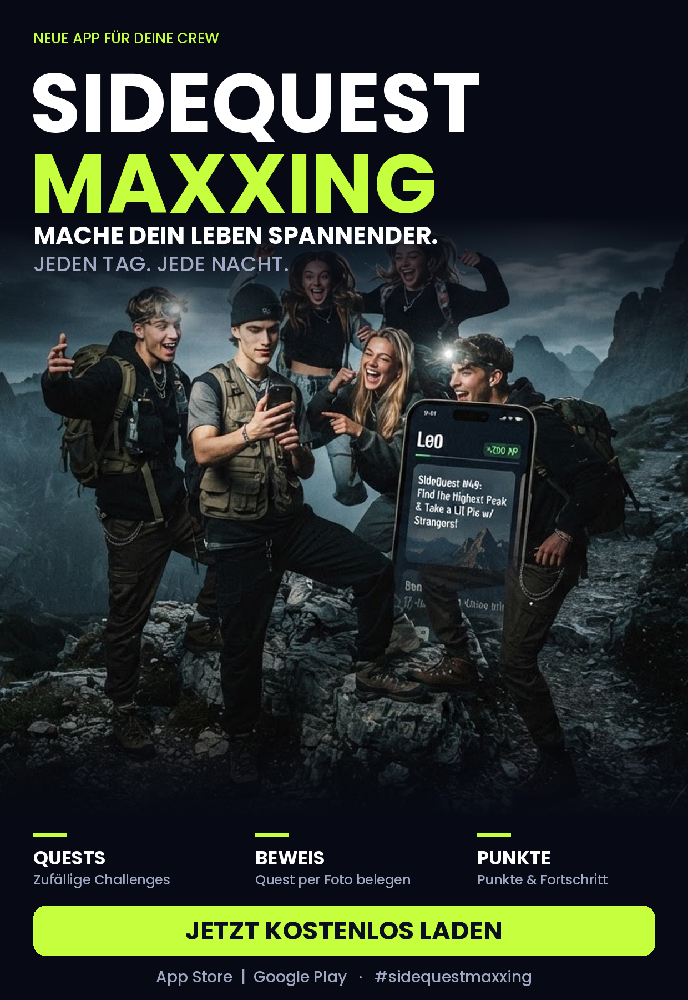

# SideQuestMaxxing (SQM)

## Produkt / Kurzbeschreibung

**SideQuestMaxxing** ist eine Mobile-App, die den Alltag in kleine, spontane „Side Quests“ verwandelt. Die App gibt den Nutzern verschiedene Challenges, die sie alleine oder mit Freunden absolvieren müssen.

## Zielgruppe

Die App richtet sich hauptsächlich an Jugendliche und junge Erwachsene, die gerne mit Freunden unterwegs sind, neue Orte entdecken und aus normalen Spaziergängen oder Treffen etwas Unterhaltsames machen möchten.

## Unique Value Proposition

**SideQuestMaxxing macht dein langweiliges leben spanndener**

## Preisstrategie

**Free** Die App soll kostenlos sein, damit möglichst viele Personen die App ausprobieren und nutzen können.

## Distribution / Placement

Die App wird über den **Apple App Store** und den **Google Play Store** angeboten und zusätzlich über Social-Media-Plattformen wie TikTok beworben

## Promotion-Massnahmen

- **TikTok-Challenges:** Kurze Videos mit lustigen oder ungewöhnlichen Side Quests werden veröffentlicht und Nutzer können ihre eigenen Ergebnisse teilen.
- **Freunde-Challenge:** Nutzer können Freunde zu einer bestimmten Side Quest herausfordern und ihre Ergebnisse miteinander vergleichen.

## Minimal erforderliche Hauptfunktionalitäten (MVP)

- **Side Quests anzeigen:** Die App generiert zufällige Challenges, die der Nutzer auswählen und starten kann.
- **Quest abschliessen:** Eine Quest kann abgeschlossen und beispielsweise mit einem Foto als Beweis dokumentiert werden.
- **Punkte und Fortschritt:** Nutzer erhalten Punkte für abgeschlossene Quests und können ihren persönlichen Fortschritt verfolgen.